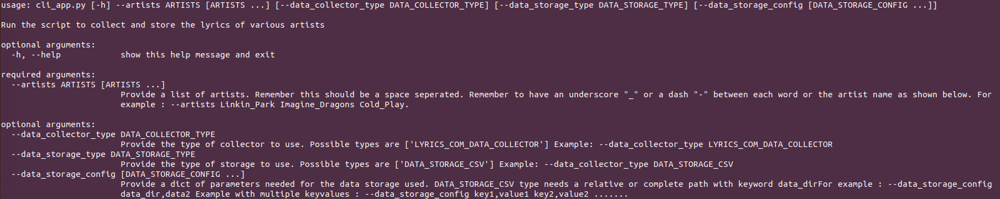

# Lyrics Data Collector

## Overview

- A simple data collector cli api for collecting lyrics of various artists.

 
## How to Run Locally
The application was able to run on Ubuntu 20.04 machines (one with 2GB and another with 8GB RAM) with the default settings by following the instructions below. Python version 3.9 was used. Install the packages provided in requirements.txt file using `pip install -r requirements.txt`
The command line application can be run by running python script `LyricsDataCollector/cli_app.py`.
An example for collecting artists lyrics from lyrics.com and storing it in seperate csv file for each artist in relative directory `data` is as follows:
```
  $ python cli_app.py --artists Linkin-Park Imagine-Dragons
```

## Comprehensive Instructions



- Extensive example specifying data collector and data storage type.
```
$ python cli_app.py --artists A-B-D-U-L A-1000-Days-Gone --data_collector_type LYRICS_COM_DATA_COLLECTOR --data_storage_type DATA_STORAGE_CSV --data_storage_config data_dir,data3

```
- Above custom data collector is using argument `--data_collector_type LYRICS_COM_DATA_COLLECTOR` and normal csv file storage is used by using argument `--data_storage_type DATA_STORAGE_CSV` and csv files are stored in directory `data3` using argument `--data_storage_config data_dir,data3`. If these arguments are not specified then above settings are default with the data directory being the relative directory `data` to project folder.


## Further Improvements

- Different data collectors can be added easily.
- Different data storages can be added easily.
- This frame work can extended to inlcude a model classes and easily extend this data pipeline to include model traning and deployment.
- Improve the cli api for even better readability and robustness.
